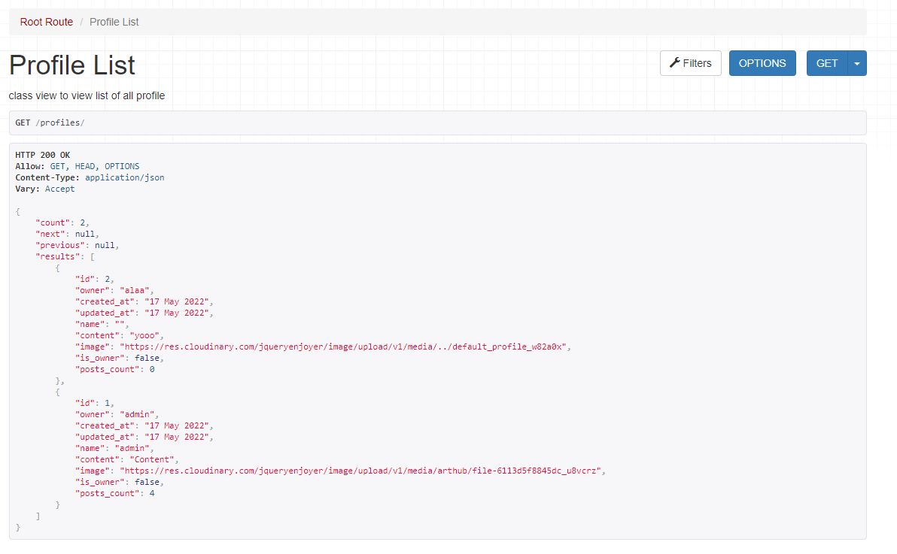
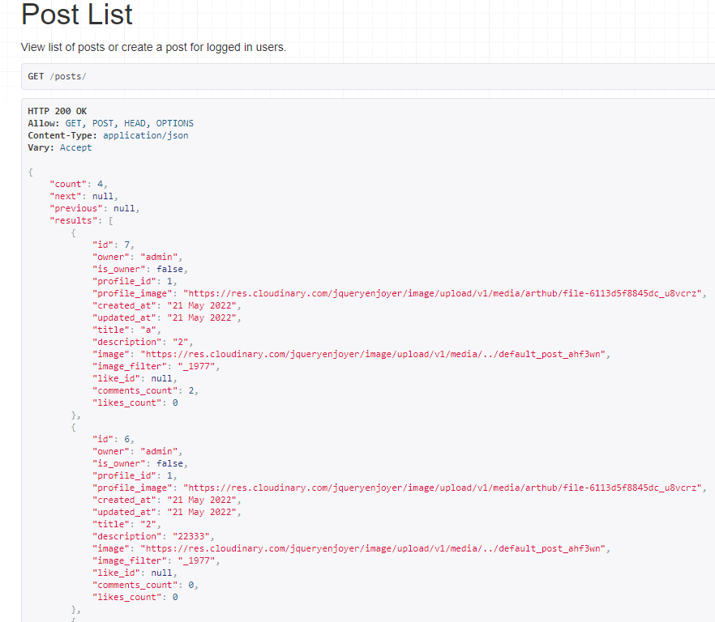
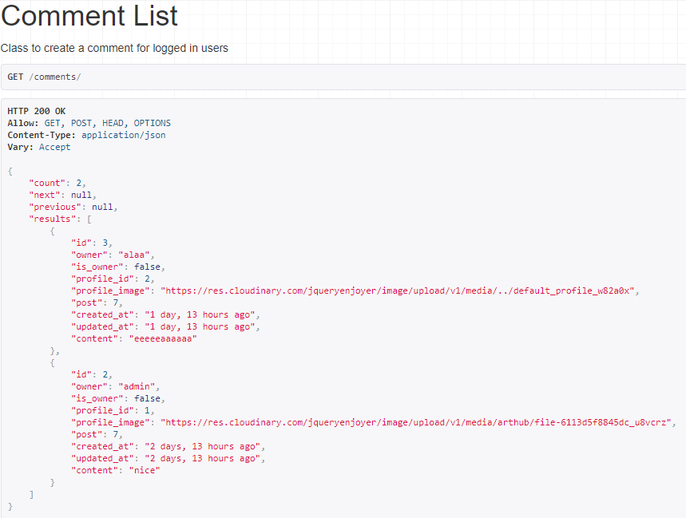
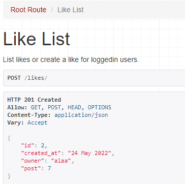
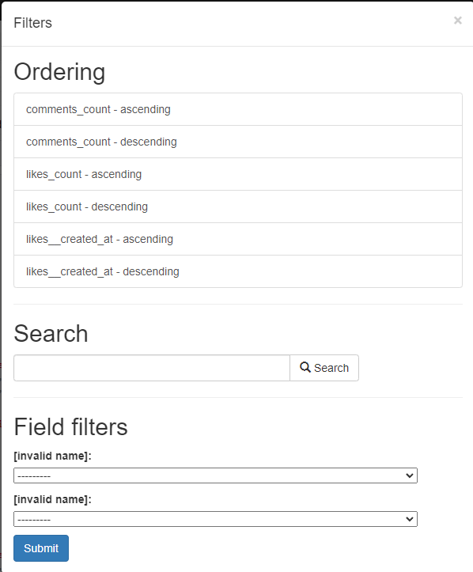

# ArtHub DRF API
Django rest framework API Created to handle data for the Arthub react application. It allows users to store and mainpulate data with costume applications:
<ul>
<li>Profiles</li>
<li>Posts</li>
<li>Comments</li>
<li>Likes</li>
</ul>
all applications handle CRUD functionality for the users by sending and reciving data from the front end react application <strong>ArtHub</strong>

[Heroku Deployed API](https://arthub-api.herokuapp.com/)
 
[ArtHub Deployed Site](https://arthub-react.herokuapp.com/)
## Main functionalities

<ul>
<li>Creating, viewing, editing and deleting a profile</li>
<li>Creating, viewing, editing and deleting a post, connected to the prfoile application </li>
<li>Creating, viewing, editing and deleting a comment connected to the post application</li>
<li>Creatingand deleting a like connected to the post</li>
<li>Data filtering for profiles, and posts</li>
</ul>

[DATA SCHEMA](https://lucid.app/lucidchart/57c55a9c-ab77-481e-8605-f0e95ca94fd6/edit?viewport_loc=-425%2C-69%2C2219%2C1108%2C0_0&invitationId=inv_d8ae8854-8193-4f76-8e6f-16a44ca27881#)

## Dependencies

<ul>
<li>Django.</li>
<li>Django-cloudinary-storage</li>
<li>Pillow.</li>
<li>Django rest framework.</li>
<li>Rest framework</li>
<li>Dj-rest-auth</li>
<li>Dj_database_url</li>
<li>Psycopg2</li>
<li>Gunicorn</li>
<li>corsheaders</li>
<li>Django filters</li>
<li>simple JWT</li>
</ul>

## User Stories

<ul>
<li>

[User Profile](https://github.com/Hijazi-alaa/My-api/issues/1)
</li>
<li>

[Authentication and authorization](https://github.com/Hijazi-alaa/My-api/issues/2)
</li>
<li>

[Posts](https://github.com/Hijazi-alaa/My-api/issues/3)
</li>
<li>

[Comments](https://github.com/Hijazi-alaa/My-api/issues/4)
</li>
<li>

[Likes](https://github.com/Hijazi-alaa/My-api/issues/5)
</li>
<li>

[Post count](https://github.com/Hijazi-alaa/My-api/issues/6)
</li>
<li>

[Comments and likes count](https://github.com/Hijazi-alaa/My-api/issues/7)
</li>
<li>

[Search bar](https://github.com/Hijazi-alaa/My-api/issues/8)
</li>
<li>

[Filter posts](https://github.com/Hijazi-alaa/My-api/issues/9)
</li>
<li>

[Comments filter](https://github.com/Hijazi-alaa/My-api/issues/10)
</li>
</ul>

## Testing 

### Validation
All files passed through the PEP8 checker with no issues.

### Manual testing

<ol>
    <li>Profiles
        <ul>
            <li>Tested creating a profile and checked that profile data is added to the database</li>
            <li>Tested Viewing the profile list.</li>
            
            <li>Tested editing a profile and confirmed that editng a profile is only possiable for the profile owner, and it changes the profile data in the database</li>
        </ul>
    </li>
    <li>Posts
        <ul>
            <li>Tested creating a Post and checked that profile data is added to the database</li>
            <li>Tested create a post form is only acceable to logged in users</li>
            <li>Tested Viewing the posts list</li>
            
            <li>Tested editing a post and confirmed that editng a post is only possiable for the post owner, and it changes the post data in the database</li>
            <li>Tested deleting a post and confirmed it's only allowed for the post's owner to delete it and that deleting a post remove the data from the database.</li>
        </ul>
    </li>
    <li>Comments
        <ul>
            <li>Tested creating a Comment on a post and checked that Comment is added to the post by its ID</li>
            <li>Tested create a comment form is only acceable to logged in users</li>
            <li>Tested Viewing the comments list</li>
            
            <li>Tested editing a comment and confirmed that editng a comment is only possiable for the comment owner, and it changes the comment data in the database</li>
            <li>Tested deleting a comment and confirmed it's only allowed for the comment's owner to delete it and that deleting a comment remove the data from the database.</li>
        </ul>
    </li>
    <li>Likes
        <ul>
            <li>Tested to add a like on a post and checked that the like is added to the post by its ID</li>
            <li>Tested adding a like is only acceable to logged in users</li>
            <li>Tested Viewing the likes list</li>
            
            <li>Tested removing a like and confirmed it's only allowed for the user who made the like owner to remove it and that remving a like  remove the data from the database.</li>
        </ul>
    </li>
    <li>Filtering and search
        <ul>
            <li>Tested filtering the profiles list and confirmed it changes the order of the profile list</li>
            <li>Tested filtering the posts list and confirmed it changes the order of the posts list depending on the filter used 
            </li>
            
        </ul>
    </li>
</ol>

## Deployment 

#### Setting up Project for deployment
Starting Django project in workspace and connecting the Cloudinary database to your app
<ul>
<li>Install DJango with the command<strong>pip3 install django</strong></li>
<li>Start your Django project with the command <strong>django-admin startproject (app name)</strong></li>
<li>Connect Django project to cloudinary databse by installing the cloudinary library with the command:<strong>pip install django-cloudinary-storage</strong></li>
</ul>
<li>Install pillow for image proccesing with the command<strong>pip install Pillow</strong></li>
<li>Add the newly installed apps to setting.py installed apps.</li>
<li>Create env.py file and add a cloudinary url provided with the cloudinary environment variable from cloudinary account dashboard</li>
<li>Load the envirement variable from env.py file to settings.py</li>
<li>Set the media URL and a default file storage path in setting.py</li>

#### Requirements.txt
Heroku deployment requires a populated file of all dependencies used during the site build:
In the GitPod terminal, type pip3 freeze --local > requirements.txt to create your requirements file.

#### Set up JWT library
<ul>
<li>install simpleJWT with the command:<strong>pip install djangorestframework-simplejwt</strong></li>

#####
When following the simple JWT documentation we are instructed to follow these steps:

<li>set up the app to use session when in development, and JWT tokens when in production, by setting DEV = 1 in env.py file and provide rest framework rule in settings.py</li>
<li>Set RESE_USE_JWT and JWT_AUTH_SECURE to true in settings.py</li>
<li>Declare cookie names in settings.py</li>
<li>Run migrations to the database.</li>
</ul>

#### Adjustments to Settings before deployment
<ul>
<li>Change the default render class for rest framework to json in settings.py.</li>
</ul>

#### Create application:

<ul>
<li>Login to Heroku.</li> 
<li>Click on 'Create New App' from your dashboard.</li> 
<li>Enter a unique app name.</li> 
<li>Select the appropriate region closest to your location.</li> 
<li>Add Heroku postgres app under resourcers and choose the free plan.</li>
<li>Set up config vars:</li>
</ul>

#### Set up your project to use heroku postgres databse
<ul>
<li>Install dj databae url and pscyopg2 library with the command:<strong>pip install dj_database_url psycoph2</strong> and add the databse URL environment variable into the databases when in production, in settings.py</li>
<li>Install gunicorn and django cors headers</li>
<li>Create a Procfile providing the app name where required web: gunicorn [app_name].wsgi:application</li>
<li>Add allowed hosts  and allowed origins to settings.py</li>
<li>add secret key to env.py (make sure the env.py is ignored)</li>
<li>Add secret key to config vars under settings in your heroku app.</li>
<li>and disable statics files in config vars.</li>
<li>Updare requirements.txt file one last time.</li>
</ul>

#### Connecting Github repo to the Heroku app 
<ul>
<li>Back in my API workspace add, commit and push to github.</li>
<li>Install the heroku cli with the command:
<strong>npm install -g heroku</strong></li>
<li>Log in to Heroku in the terminal with the command <strong>heroku login -i</strong> and enter username and password</li>
<li>Then connect remotly to the heroku application created earlier by entering the command: <strong>
heroku git:remote -a arthub-react (app name on heroku)</strong></li>
<li>Push to heroku with the command: <strong>git push heroku main</strong></li>
</ul>

## Credits
<li>The Code institute's Django rest frame work project was a huge point of reference on so many occasions while coding my application.</li>
<li>My mentor Rohit Sharma provided much appreciated guidance</li>
<li>Code instiute's Tutor Assistance for providing help through out the project</li>
</ul>

The entire project was a great experience with that said there is much yet for me to learn, and expand on this application considering due to the short available time I had to finish both the back and the front end in one week.